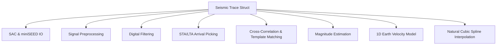

# MoonBit 国产基础软件大赛 / 黑客松项目申报书

## 1. 项目基本信息

*   **项目名称**：`moonbit 地震波信号处理库`
*   **项目标识**：`moonbit-seismic`
*   **项目方向**：工程基础设施与应用生态（地球物理信号处理与数值分析）
*   **项目授权协议**：Apache-2.0 开源许可证
*   **申报类型**：原创项目（完全采用 MoonBit 语言原生实现，无第三方依赖）
*   **唯一贡献者**：Wchch (账号创建者，邮箱：`3526960494@qq.com`)
*   **项目开源仓库链接**：
    *   **GitHub 仓库**：[wch6766/moonbit-seismic](https://github.com/wch6766/moonbit-seismic)
    *   **GitLink 仓库**：[Wchch/moonbit-seismic](https://gitlink.org.cn/Wchch/moonbit-seismic)

---

## 2. 项目立项背景与生态价值

在地震物理、地球物理勘探（石油与矿产勘探）以及高校教学实验领域，地震波信号处理是极其核心的一环。目前主流的地震数据处理工具库（如 ObsPy、SAC、SeisComp 等）主要基于 Python、C++ 或 Fortran 实现，尚无专门面向国产新型编程语言 MoonBit 生态的高性能地震波处理库。

本项目旨在填补这一空白，推出 **`moonbit-seismic`** 信号处理库。基于 MoonBit 极快的编译速度、高效的执行性能、极小的二进制体积以及多平台（Wasm / JS / Native）编译支持，该库具有深远的生态价值：
1.  **科学计算平台验证**：验证 MoonBit 语言在地球物理、大规模数据解析及数值过滤等高计算密度场景下的优异性能与稳定性。
2.  **教学与实验轻量化**：通过 Wasm 轻松部署到浏览器端，为地球物理教学实验提供免安装、即开即用的轻量级交互式学习工具。
3.  **地学软件国产化**：探索利用国产核心工具链实现专业地质地球物理计算引擎的新路径。

---

## 3. 项目核心模块与具体实施细节

本库设计紧凑、层次分明，包含以下 9 大核心功能模块，为开发者和研究人员提供完整的处理工作流：

### 3.1 核心数据结构与预处理 (`types.mbt`)
-   **`Trace` 结构体**：封装了单通道地震波的核心元数据（台站名 `station`、通道名 `channel`、采样率 `sampling_rate`、起始时间 `start_time`）和浮点型震动振幅数据序列（`data`）。
-   **去均值 (`demean`)**：消除仪器零点漂移。
-   **去线性趋势 (`detrend`)**：基于最小二乘线性回归算法，剔除长周期非震信号背景噪声。

### 3.2 地震数据格式读取与写入 (`sac.mbt` & `miniseed.mbt`)
-   **SAC (Seismic Analysis Code) 二进制解析**：支持 Little-Endian / Big-Endian 双端自动识别与解析，读取 632 字节复杂文件头和数据点，实现与 Trace 的高保真转换与重新序列化。
-   **miniSEED 文件解析**：简化解析 Fixed Section of Data Header (FSDH) 字节流，支持未压缩 32 位整型/浮点型数据重构。

### 3.3 数字信号滤波器 (`filter.mbt`)
-   **2 阶 IIR 巴特沃斯滤波器**：支持低通 (Lowpass)、高通 (Highpass)、带通 (Bandpass) 和带阻 (Bandstop/Notch) 四种滤波模式。
-   **零相位滤波 (`filtfilt`)**：通过前向、反向两次双向滤波，彻底消除 IIR 滤波器带来的相位延迟，确保地震震相到时的准确测量。
-   **移动平均平滑器**：快速抑制高频随机突变噪声。

### 3.4 地震动互相关匹配 (`correlation.mbt`)
-   **归一化互相关 (NCC)**：计算两段波形的相似性，输出滑动延迟（Lag）相关系数序列，自动捕获最佳时差偏置，适用于微震检测和重复地震研究。

### 3.5 地震波到时拾取 (`picking.mbt`)
-   **STA/LTA 算法**：实现 $O(N)$ 线性复杂度的短动 / 长动能量均值比值滑动窗算法，避免了 $O(N^2)$ 的嵌套循环计算。
-   **双阈值触发器**：自动识别地震事件在比值曲线上跨越 Threshold Onset 和 Offset 的时间窗口。

### 3.6 震级计算 (`magnitude.mbt`)
-   **近震震级 $M_L$ (Richter Local Magnitude)**：基于模拟 Wood-Anderson 地震仪记录的峰值振幅与震中距校正函数。
-   **体波震级 $M_b$ 与面波震级 $M_s$**：支持远震体波、面波震级的快速解算。

### 3.7 走时曲线计算 (`traveltime.mbt`)
-   **1D 分层速度模型**：支持自定义地壳层状波速结构，内置全球标准的 **`IASPEI91`** 全球速度模型。
-   **路径积分走时计算**：使用积分平均慢度方法，稳健计算直达波、折射波的 P 波与 S 波理论旅行时。

### 3.8 速度模型插值 (`interpolation.mbt`)
-   **线性插值** 与 **自然三次样条插值 (Natural Cubic Spline)**：利用 Thomas 算法求解三对角矩阵方程，输出二阶导数连续的平滑波速-深度剖面。

---

## 4. 实施计划与交付物

### 4.1 开发计划
-   **第一阶段：框架定义与基础 I/O 模块开发**
    -   实现核心 Trace 数据模型，完成 SAC 格式与 miniSEED 格式二进制字节级读写引擎。
-   **第二阶段：信号预处理与滤波算法实现**
    -   编写 IIR 巴特沃斯滤波器、零相位滤波，以及 STA/LTA 拾取算法。
-   **第三阶段：地物理分析、走时计算与插值引擎开发**
    -   完成 1D IASPEI91 模型、路径积分走时计算和自然三次样条插值实现。
-   **第四阶段：多平台兼容与单元测试覆盖**
    -   编写黑盒与白盒测试用例，覆盖全部核心函数边界。设置 GitHub Actions CI 实现自动化编译与跨平台检验。

### 4.2 预期交付成果
-   **MoonBit 源代码**：一个模块化、通过 `moon check --deny-warn` 并且 100% 格式化通过的代码库。
-   **自动化测试套件**：8 个覆盖率高、警告清零的单元测试。
-   **CLI 可运行演示**：直接运行 `moon run cmd/main` 输出完整业务逻辑展示。
-   **CI 自动化工作流**：支持多平台的 `.github/workflows/test.yml`。

---

## 5. 项目合规与版权声明

1.  本项目为作者 **Wchch** 独立原创开发。
2.  代码中不包含任何第三方闭源库，亦无任何可能侵犯他人版权的第三方开源代码移植或拷贝。
3.  测试数据均为符合科学规范的合成地震信号，不涉及任何保密地学数据。
4.  项目采用 **Apache-2.0** 许可证，允许地学界及生态圈开发者自由分发、引用或二次开发。
